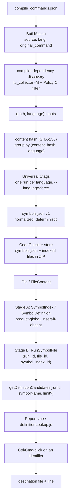

# Symbol index and jump-to-definition: architecture

This document describes the implemented design of the symbol index and the
jump-to-definition feature of the report viewer. The user-facing parts are
documented in the [analyzer user guide](../analyzer/user_guide.md#symbol-index),
the [web user guide](../web/user_guide.md#storing-the-symbol-index) and the
in-app user guide (*Jump to definition*). Design rationale is recorded in the
[decision log](decisions.md). See also [how it works](how-it-works.md), the
[study guide](STUDY-GUIDE.md) and the [defense questions](defense-questions.md).

## Table of Contents

- [Overview](#overview)
- [Data flow](#data-flow)
- [Identities](#identities)
- [Phase 1: analyzer-side indexing](#phase-1)
- [Phase 2: transport and persistence](#phase-2)
- [Phase 3: definition candidate API](#phase-3)
- [Phase 4: report viewer navigation](#phase-4)
- [Lifecycle and garbage collection](#lifecycle)
- [Source map](#source-map)

## Overview <a name="overview"></a>

The feature answers one question: *"for this identifier, shown in the source
of a report, where can it be defined in the analyzed project?"* It is
name-based: the answer is a list of candidate definitions found by
[Universal Ctags](https://ctags.io), not a compiler-semantic resolution.

The work is split along ownership boundaries:

| Part | Owns | Knows nothing about |
|---|---|---|
| Analyzer (`CodeChecker analyze --symbol-index`) | build actions, languages, compiler dependency discovery, Ctags | database, runs |
| Store (`CodeChecker store`) | shipping `symbols.json` and the indexed files in the store ZIP | Ctags |
| Server | deduplicated persistence, run membership, GC, candidate query | compilers, Ctags |
| Thrift API | public candidate list | languages' semantics |
| Web viewer | identifier extraction, choosing among candidates, navigation | how candidates were produced |

## Data flow <a name="data-flow"></a>



## Identities <a name="identities"></a>

| Entity | Identity | Why it exists |
|---|---|---|
| `FileContent` | `content_hash` | Existing CodeChecker table: the bytes of a source file, stored once per product regardless of path or run. |
| `File` | `id`, unique `(filepath, content_hash)` | Existing table: *where* given bytes were seen. A path with new content becomes a new `File`. |
| `SymbolIndex` | `(content_hash, language)` | *What Ctags found* in given bytes under one language interpretation. Byte-identical files share it; the same header compiled from C and from C++ gets two indexes because Ctags' C and C++ parsers may produce different tags. |
| `SymbolDefinition` | `id`, belongs to one `SymbolIndex` | One normalized Ctags definition (`name`, `kind`, `line`, optional `end_line`, `scope`, `scope_kind`, `signature`, `typeref`). Lives and dies with its index. |
| `RunSymbolFile` | `(run_id, file_id, symbol_index_id)` | *Which* files and language interpretations belong to the *current* state of a run. `File` alone cannot say "this header is indexed once as C and once as C++ in this run", and a product-global `SymbolIndex` cannot say which runs use it. |

## Phase 1: analyzer-side indexing <a name="phase-1"></a>

`analyzer/codechecker_analyzer/symbol_index.py`, called from `analyze.py`
after the analysis when `--symbol-index` is given.

1. **Inputs.** For every `BuildAction` the source file plus the headers the
   compiler reports with `-M` (`tu_collector.get_dependent_headers()` on
   `action.original_command`) are collected with the action's language.
2. **Policy C filter** (`is_indexable_dependency()`): drop files under the
   compiler's implicit include directories (same probe and cache key as
   `ImplicitCompilerInfo`), keep files under explicitly given `-I`, `-isystem`,
   `-iquote`, `-idirafter` directories when they are an equally or more
   specific match. Paths are resolved first.
3. **Identity.** `group_by_identity()` hashes files with the shared
   `codechecker_common.util.get_file_content_hash()` (the one `store` uses) and
   groups by `(content_hash, language)`.
4. **Ctags.** One representative path per identity, one Ctags process per
   language, `--language-force`, JSON output, definitions only
   (`--extras=-r`, `roles == def`). No compiler flags are forwarded.
5. **Normalization** (`normalize_tag()`) to the application-owned schema and
   a total sort order; `symbols.json` (`version: 1`) lists every path of an
   identity.

A missing or unsuitable Ctags fails before the analysis; a failure of index
generation after the analysis keeps the reports but fails the command.

## Phase 2: transport and persistence <a name="phase-2"></a>

**Store client** (`web/client/codechecker_client/cli/store.py`):
`symbols.json` is validated (`codechecker_common/symbols_json.py`) and added
to the ZIP; every indexed path whose content still matches its hash is added
to the uploaded source files, so clean headers without reports exist on the
server. Missing or changed files are logged and left out.

**Server** (`web/server/codechecker_server/api/symbol_index_store.py`, called
from `mass_store_run.py`):

- **Stage A** `store_symbol_indexes()` runs after `FileContent` rows exist and
  before the run transaction. It inserts missing `SymbolIndex` +
  `SymbolDefinition` rows in small batched transactions (50 indexes), reuses
  existing ones, and retries a batch on UNIQUE/lock conflicts, so parallel
  stores of the same content converge on one row. Indexes whose content is
  not in `file_contents` are skipped before insert.
- **Stage B** `replace_run_symbol_files()` runs inside the run transaction once
  `Run.id` is known. It deletes the run's memberships and inserts the new set.
  A membership is only created if the `File` exists for the (trimmed) path,
  its `content_hash` equals the index's, and the index exists. Problems skip
  that membership and are logged; the store continues.

Schema: migration `a7c2d5e9f1b3`. All foreign keys are
`ON DELETE CASCADE`, deferrable, like the rest of the run database.

## Phase 3: definition candidate API <a name="phase-3"></a>

`codechecker_api/report_server.thrift` (API 6.75):

```thrift
DefinitionCandidateList getDefinitionCandidates(
    1: i64 runId, 2: string symbolName, 3: optional i64 limit)
```

`DefinitionCandidate` exposes `fileId`, `filePath`, `line`, `kind`,
`language` and optional `endLine`, `scope`, `scopeKind`, `signature`.
Internal row IDs and `typeref` are not exposed.

`find_definitions()` joins
`RunSymbolFile -> SymbolIndex -> SymbolDefinition -> File`, filtered by
`run_id` and exact `name`, ordered by
`(filepath, language, line, kind, File.id, SymbolDefinition.id)` and limited
after ordering. The order is a stable transport order, not a ranking.
Empty/whitespace names are rejected; unknown runs, runs without an index and
unknown names return `[]`.

## Phase 4: report viewer navigation <a name="phase-4"></a>

`web/server/vue-cli/src/components/Report/definitionLookup.js` (pure helpers)
and `Report.vue` (integration):

1. A primary-button **Ctrl-click** (Cmd on macOS) in a C/C++ source
   (explicit extension list) is intercepted; CodeMirror's Ctrl/Cmd-click
   multi-cursor is disabled only in these files.
2. `symbolAt()` resolves the Lezer syntax-tree node at the click (bounded
   parse, both sides of a token boundary) and accepts only `Identifier`,
   `FieldIdentifier`, `TypeIdentifier`, `NamespaceIdentifier`,
   `DestructorName`. Comments, strings, includes, keywords, numbers and
   `#define` bodies yield nothing and send no request.
3. `getDefinitionCandidates(report.runId, name)`; stale responses are dropped
   via a request sequence.
4. `collapseCandidates()` merges candidates that differ only in language
   (C and C++ index of the same header) and keeps all languages for display.
5. 0 candidates: disabled *No definition found* entry; 1: navigate; N: picker
   with `scope::name(signature)` and `kind · file:line · languages`.
6. Navigation loads the file (`setSourceFileData`), redraws the report's bug
   path for that file (`drawBugPath`), clamps the line and scrolls
   (`jumpTo`). A single **Back to report** restores the report (`init`).

## Lifecycle and garbage collection <a name="lifecycle"></a>

Garbage collection runs at server start (`db_cleanup.remove_unused_files`):

```
File        live if referenced by a report path OR a RunSymbolFile
SymbolIndex live if referenced by a RunSymbolFile OR its content_hash
            belongs to a live File   ("Option SR")
FileContent live if referenced by a File, an AnalysisInfoFile OR a SymbolIndex
```

Deleting a run cascades its memberships; the next GC removes files, indexes
(and with them definitions) and contents nobody references. Option SR keeps
the index of an old file version that a resolved report still displays, but
lookup itself is always run-scoped through `RunSymbolFile`, so such retained
indexes never appear in query results.

## Source map <a name="source-map"></a>

| Concern | File |
|---|---|
| CLI options | `analyzer/codechecker_analyzer/cli/analyze.py` |
| Indexing | `analyzer/codechecker_analyzer/symbol_index.py` |
| `symbols.json` reader | `codechecker_common/symbols_json.py` |
| ZIP transport | `web/client/codechecker_client/cli/store.py` |
| Tables | `web/server/codechecker_server/database/run_db_model.py`, migration `a7c2d5e9f1b3_add_symbol_index_tables.py` |
| Stage A/B, query | `web/server/codechecker_server/api/symbol_index_store.py` |
| Store integration | `web/server/codechecker_server/api/mass_store_run.py` |
| GC | `web/server/codechecker_server/database/db_cleanup.py` |
| API | `codechecker_api/report_server.thrift`, `web/server/codechecker_server/api/report_server.py` |
| Frontend | `web/server/vue-cli/src/components/Report/definitionLookup.js`, `Report.vue`, `src/services/api/cc.service.js` |
